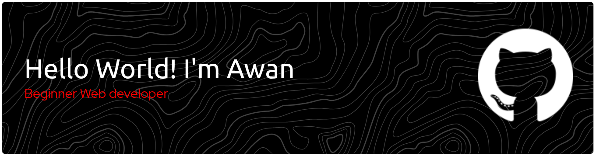

<!--  -->

<!-- ### About me:

I, Awan, am learning programming languages.

##### This:

##### The operating system I use :

##### Socials

##### My Github Stats

 -->

###

 

<h2 align="center">Hi, everyone</h2>
<h4 align="center">I, Awan, am learning programming languages.</h4>

---

##### Play Games Pacman With Me:

<picture>
  <source media="(prefers-color-scheme: dark)" srcset="https://raw.githubusercontent.com/nanastywn/nanastywn/output/pacman-contribution-graph-dark.svg">
  <source media="(prefers-color-scheme: light)" srcset="https://raw.githubusercontent.com/nanastywn/nanastywn/output/pacman-contribution-graph.svg">
  
</picture>

###

  

##### Github Stats:

  

---

###

###

  
  
  

###

  
 
 

 

##### The operating system used:

  
  
  
  
---

##### Application used:

  
  
  

---

##### Contact Me:

  
  
  

##### Play games Snake With Me:

###
